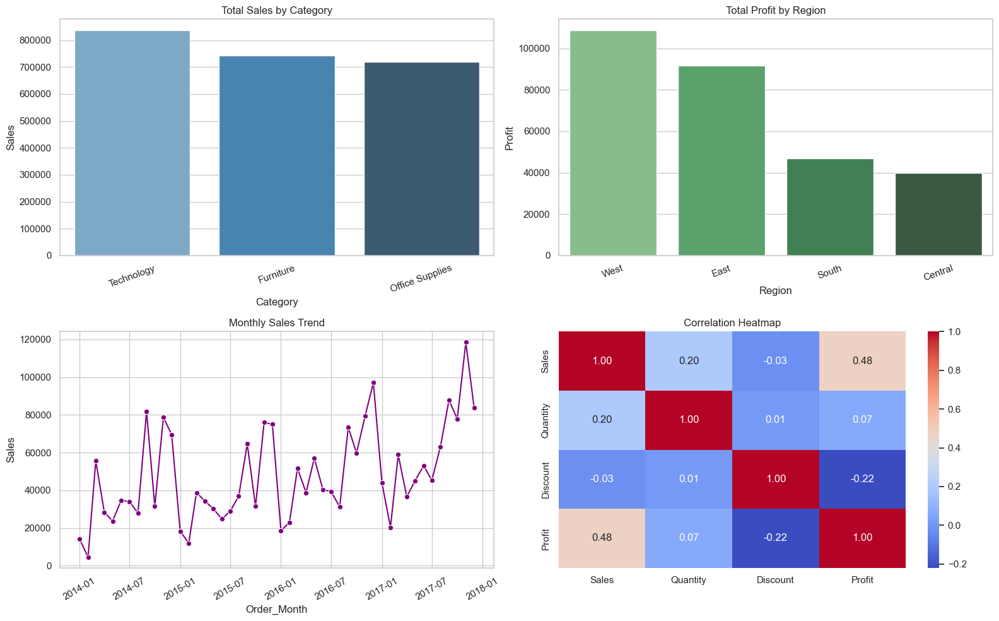
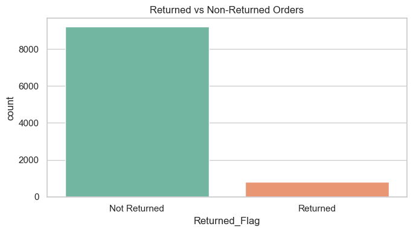
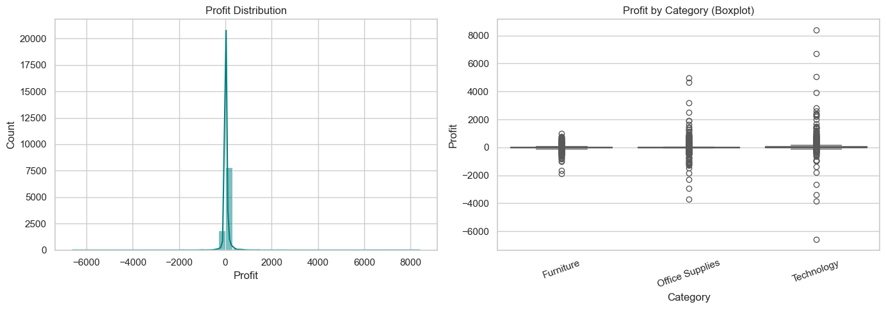
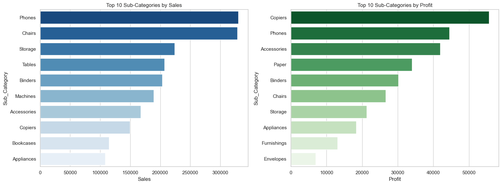
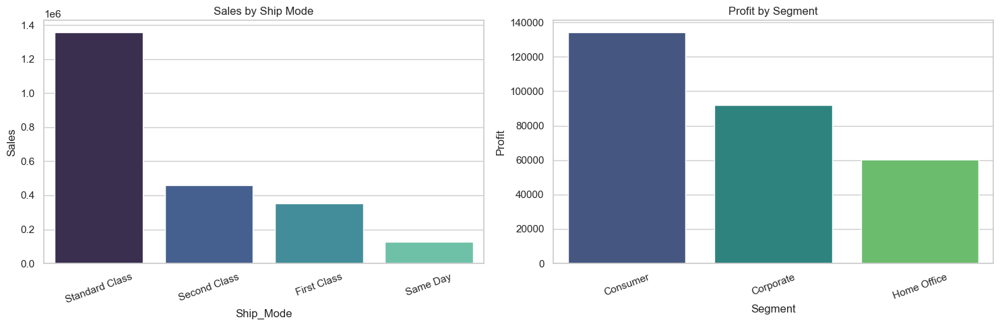
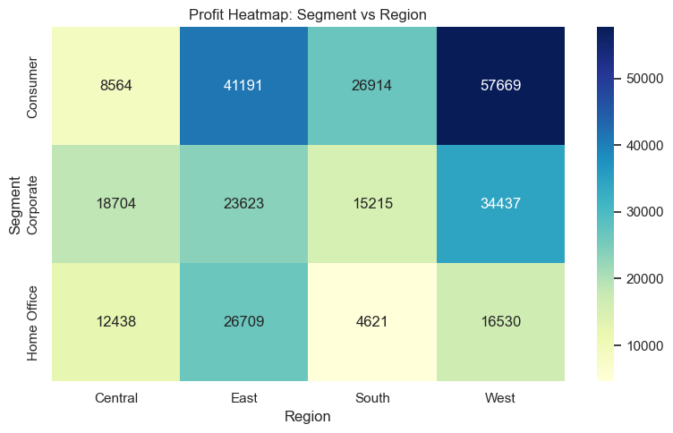
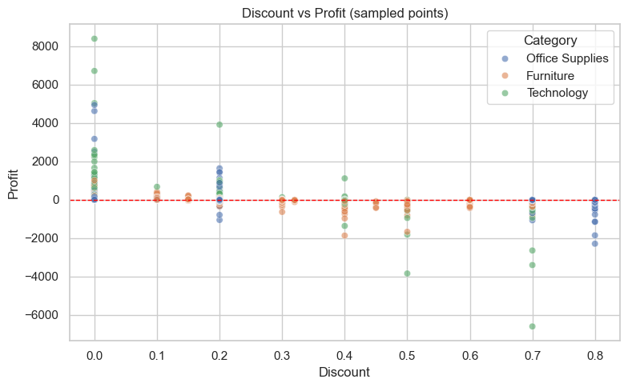
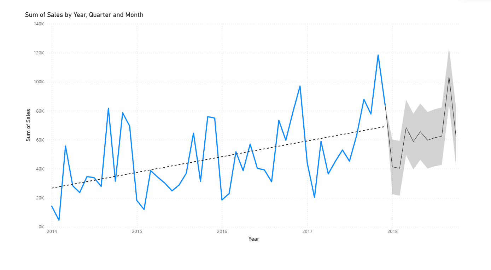
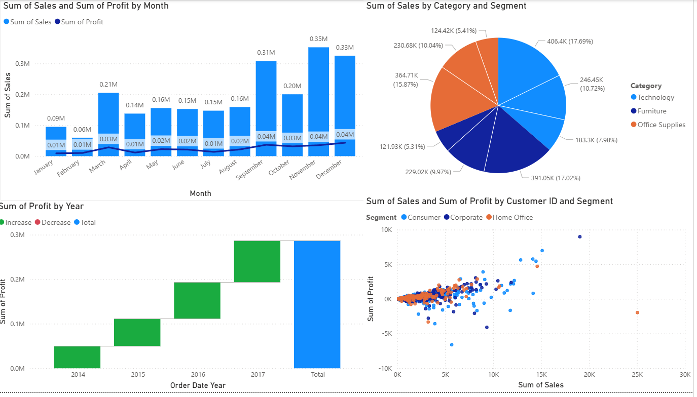
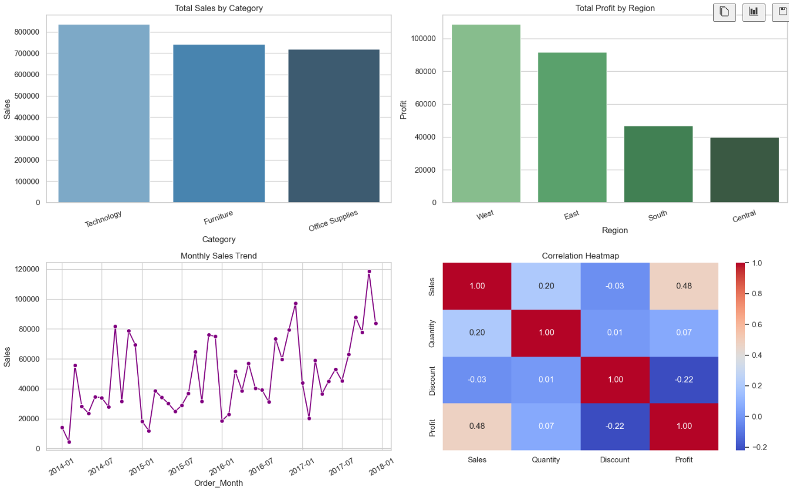

# Superstore Data Analysis (EDA)

This project analyzes the `Sample - Superstore.xlsm` dataset using Python in Jupyter Notebook.

## Project Files

- `EDA.ipynb` - Main notebook with data cleaning, visualization, and business insights
- `Sample - Superstore.xlsm` - Source dataset (sheets: `Orders`, `Returns`, `People`)
- `analysis.pdf` - Existing reference report
- `Analysis.pbix` - Power BI file

## Charts from `EDA.ipynb`

The following images were extracted from notebook outputs:









## Power BI Dashboard



<!--  -->

## Analysis Goals

- Clean and prepare raw order data
- Explore sales, profit, discount, and return patterns
- Build visualizations for category, region, segment, and shipping behavior
- Generate actionable business insights

## What is Covered in `EDA.ipynb`

1. Data loading from Excel sheets
2. Data cleaning and preprocessing
   - standardize column names
   - parse dates and numeric fields
   - handle missing values and duplicates
   - remove invalid rows
3. Core EDA visualizations
   - sales by category
   - profit by region
   - monthly sales trend
   - correlation heatmap
4. Return analysis
   - join `Orders` with `Returns`
   - return rate and profit impact
5. Additional visualizations
   - profit distribution and boxplot
   - top sub-categories by sales/profit
   - ship mode and segment analysis
   - segment-region profitability heatmap
   - discount vs profit relationship
6. KPI summary and interpretation notes

## How to Run

1. Open `EDA.ipynb` in Jupyter (VS Code/Cursor/Notebook).
2. Ensure Python has required packages:
   - `pandas`
   - `numpy`
   - `matplotlib`
   - `seaborn`
   - `openpyxl`
3. Run all cells from top to bottom.

## Quick Install

```bash
pip install pandas numpy matplotlib seaborn openpyxl
```

## Output

The notebook provides:

- cleaned dataset preview
- multiple EDA charts
- return-impact analysis
- KPI summary and business recommendations


